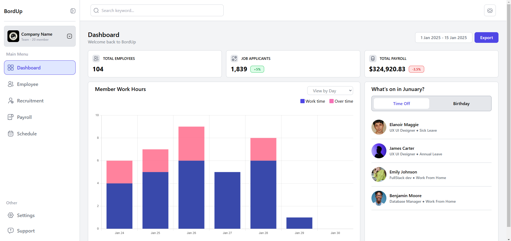

# Dashboard App

Une application de tableau de bord moderne et interactive construite avec React.js.  
Ce projet est conçu pour fournir des visualisations de données dynamiques et des informations utiles à l'aide de graphiques.

## Lien de Preview
[Voir la démo en ligne](https://dashboard-1-eight-theta.vercel.app/)

## Fonctionnalités
- **Responsive Design** : Optimisé pour les écrans de bureau et mobiles.
- **Visualisation des données** : Graphiques interactifs et dynamiques créés avec Chart.js.
- **Interface moderne** : Conçue avec Tailwind CSS pour un design épuré et efficace.

## Technologies Utilisées
- **Frontend** : React.js, Tailwind CSS
- **Graphiques** : Chart.js

## Aperçu du Projet

### Image 1 : Page principale


## Prérequis
Assurez-vous d'avoir les éléments suivants installés :
- [Node.js](https://nodejs.org/)
- [npm](https://www.npmjs.com/) ou [yarn](https://yarnpkg.com/)

## Étapes d'Installation
1. Clonez ce dépôt :
   ```bash
   git clone https://github.com/Prog-yassine/dashboard-1.git
   cd dashboard-1
   ```

2. Installez les dépendances :
   ```bash
   npm install
   ```

3. Démarrez l'application :
   ```bash
   npm start
   ```

## Structure du Projet
- **`src/components/`** : Contient les composants React utilisés pour construire l'application.
- **`src/pages/`** : Contient les différentes pages du tableau de bord.
- **`src/assets/`** : Contient les images et autres ressources.

---
